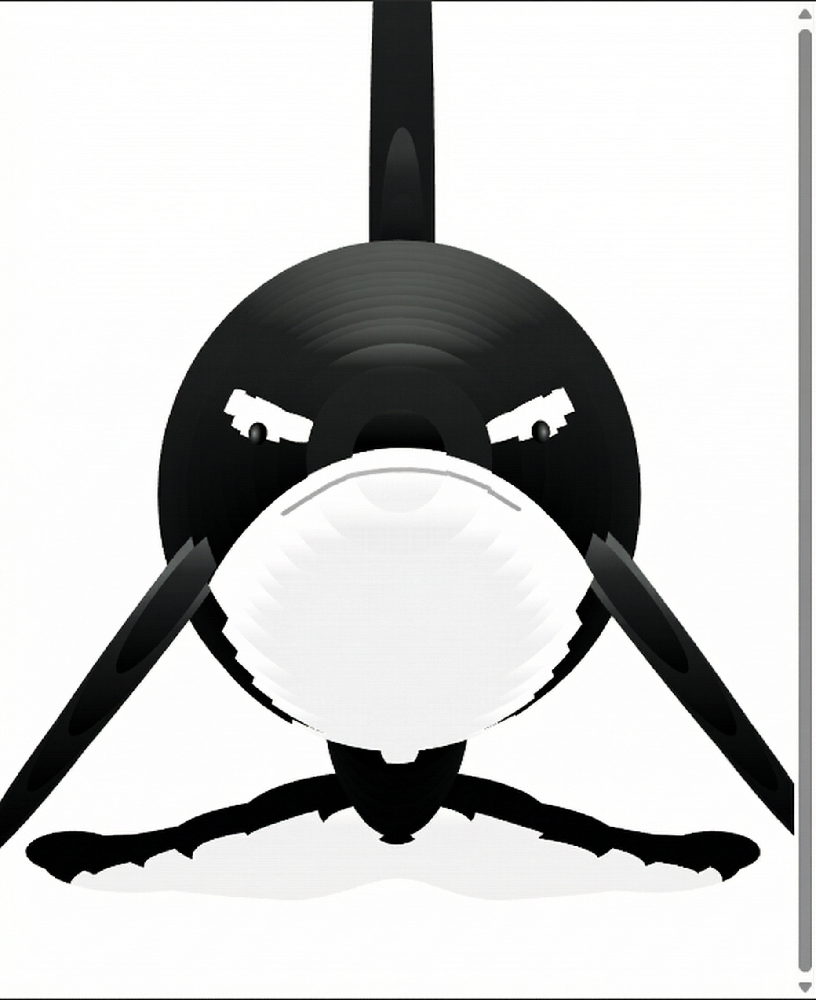

# 🐋 Interactive Whale — HTML / CSS / JavaScript

An interactive front-end animation that renders a **whale-like SVG** and makes it **smoothly follow the cursor** with a natural trailing motion.  
Built with **vanilla HTML, CSS, and JavaScript**, no frameworks, no build tools, no dependencies.

---

## 🎥 Preview



---

## ✨ What It Does

- 🐋 **Cursor-Following Animation** — The whale tracks mouse movement in real time  
- 🌊 **Smooth Trailing Motion** — Eased movement creates a fluid, organic “follow” effect  
- 📐 **Responsive by Default** — Scales to fill the entire viewport  
- ⚡ **Zero Build Step** — Runs as a static page

---

## 🛠️ Technologies Used

- 🧱 **HTML5** — Page structure  
- 🎨 **CSS3** — Full-viewport layout  
- 🧠 **JavaScript (Vanilla)** — SVG generation, animation logic, easing math  
- 🖼️ **SVG** — Vector-based whale rendering  

---

## 📁 Project Structure

```

.
├── interactive-whale.html   # Entry page
├── interactive-whale.css    # Layout styles (full viewport)
├── interactive-whale.js     # Whale renderer + motion logic
└── jquery.js                # Included (not required by current logic)

````

> ℹ️ `jquery.js` is present but not required by `interactive-whale.js`.

---

## 🚀 How to Run

### Option A — Open Directly
Open `interactive-whale.html` in your browser.

### Option B — Local Server (Recommended)

```bash
python -m http.server 8000
````

Then open:
`http://localhost:8000/interactive-whale.html`

### Option C — Node.js

```bash
npx serve .
```

---

## 🧠 How It Works (Technical Overview)

### 🎨 Rendering Model

* `interactive-whale.js` dynamically builds an SVG string
* SVG markup is injected via `element.innerHTML`
* Each whale “segment” is stored in a `parts[]` array

Each segment contains:

* `x`, `y` — current position (pixels)
* `z` — segment index (controls delay)
* `data` — SVG path markup

---

### ⏱️ Animation Loop

1. Each segment update is staggered using `setTimeout` based on `z`
2. Segments ease toward the mouse position
3. SVG is regenerated with updated transforms

This produces the smooth trailing effect.

---

### 🖱️ Input Handling

```js
document.addEventListener('mousemove', mousemove)
```

Mouse coordinates are stored as:

```js
mouse = { x: e.clientX, y: e.clientY }
```

---

### 📐 Motion & Easing Math

For each segment:

* Compute delta:

  * `dx = mouse.x - part.x`
  * `dy = mouse.y - part.y`
* Clamp delta to `maxspeed`
* Apply easing:

  * `part.x += dx / easy`
  * `part.y += dy / easy`

This prevents snapping and ensures fluid motion.

---

## 🎛️ Customization Guide

### 🧪 Motion Tuning (Recommended)

Adjust in `interactive-whale.js`:

| Variable   | Effect                                         |
| ---------- | ---------------------------------------------- |
| `fps`      | Update frequency (higher = smoother, more CPU) |
| `easy`     | Easing strength (higher = floatier motion)     |
| `maxspeed` | Max movement per tick                          |
| `delay`    | Segment lag (higher = longer trail)            |

💡 If motion feels jittery, increase `easy` or reduce `maxspeed`.

---

### 🎨 Visual Enhancements

* 🌊 Ocean gradient background
* 🫧 Bubbles, waves, or particles
* 🎨 Modify SVG fill / gradient colors
* 🔊 Sound effects on interaction

---

## 📝 Notes

* Uses **raw DOM + SVG string rendering**
* For better performance:

  * Create SVG once
  * Update transforms instead of rewriting `innerHTML`
* Canvas or WebGL would be the next optimization step

---

## 🎯 Use Cases

* 🌍 Marine or ocean-themed websites
* 🧒 Educational experiences
* 🎨 Creative coding portfolios
* 🧠 Front-end animation practice

---

## 📜 License

MIT License, free to use, modify, and experiment.


